# SKN05-FINAL-4TEAM

# COMMIT
### AI 기반 개발자 모의면접 서비스

**"디버깅 없는 커밋은 없듯, 연습 없는 성공도 없다."**

SK네트웍스 Family AI캠프 5기 · 2024.12.20 ~ 2025.02.18 (8주)

 

  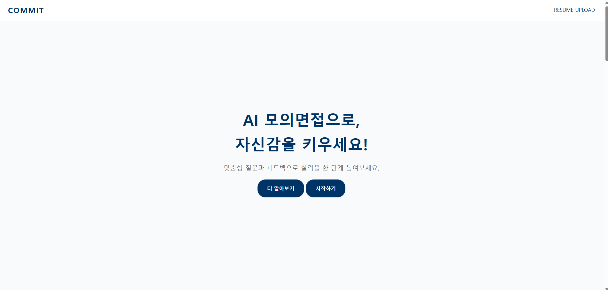

 

## 📌 Overview

**COMMIT**은 사용자의 이력서와 지원 공고를 분석해 맞춤형 면접 질문을 생성하고, 답변 내용은 물론 발음·말 빠르기·말더듬 등 **비언어적 요소까지 평가**해 상세한 피드백 리포트를 제공하는 AI 모의면접 웹 서비스입니다.

- 🔗 GitHub: [SKNETWORKS-FAMILY-AICAMP/SKN05-FINAL-4TEAM](https://github.com/SKNETWORKS-FAMILY-AICAMP/SKN05-FINAL-4TEAM.git)

 

## 🧩 Background

기업의 비대면 채용이 빠르게 확산되고 있지만, 이를 준비하는 개인 입장에서는 실전과 유사한 연습 환경이 부족했습니다.

- 국내 기업 10곳 중 6곳(67.1%)이 비대면 채용 전형을 운영 중이며, 대기업은 80.4%에 달함 *(자료: 잡코리아)*
- 기업 5곳 중 2곳이 메타버스 기반 채용을 고려하는 등 비대면 면접은 계속 확산되는 추세 *(자료: 사람인)*
- 그러나 기존 서비스들은 다음과 같은 한계를 가지고 있었습니다.

| 문제 영역 | 내용 |
|---|---|
| 환경적 제약 | 실전 면접과 유사한 경험을 제공하는 시스템 부재 |
| 사용자 맞춤화 부족 | 지원자의 배경·경험을 반영한 질문 생성과 개인화 피드백 부족 |
| 데이터·질문 생성의 한계 | 실제 면접 질문과 연계된 데이터베이스 부족으로 다양한 질문 생성이 어려움 |
| 평가·피드백의 한계 | 구체적인 개선사항 제시 부족, 비언어적 커뮤니케이션은 혼자 연습하기 어려움 |

이러한 문제를 해결하기 위해, **이력서·공고 기반 맞춤 질문 생성 → 모의면접 진행 → 언어적/비언어적 요소를 포함한 종합 피드백**을 하나의 흐름으로 제공하는 서비스를 기획했습니다.

 

## ✨ Key Features

  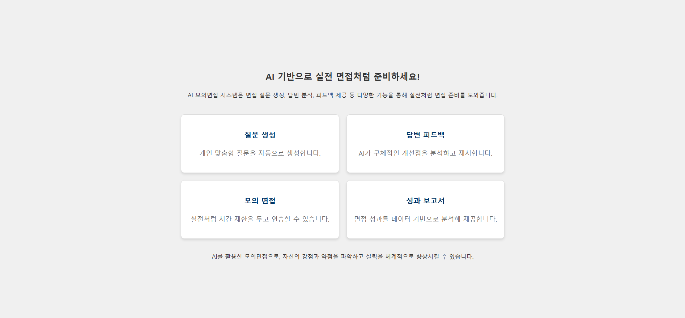

| 기능 | 설명 |
|---|---|
| 🎯 맞춤형 질문 생성 | 업로드한 이력서와 선택한 기업 공고를 바탕으로 개인 맞춤형 질문 자동 생성 |
| 🎙️ 실전형 모의면접 | 질문당 90초 제한 시간, 총 10개의 음성 답변 기반 면접 진행 |
| 📝 세분화된 답변 평가 | 5가지 세부 항목(질문 이해도, 논리적 전개, 구체성, 문제 해결 접근, 조직적합도) 기준 피드백 |
| 🗣️ 비언어적 요소 평가 | 발음, 말하기 속도, 말더듬까지 분석해 커뮤니케이션 개선점 제시 |
| 📊 AI 리포트 자동 생성 | 면접 종료 후 강점/약점, 질문별 상세 평가를 담은 리포트 자동 생성 |
| 🏢 기업 특화 면접 | 특정 기업의 인재상에 맞춘 질문·피드백 제공 |

 

## 🖥️ Screens

### 1) 모의면접 진행 방식 안내
사용자가 서비스 흐름을 한눈에 파악할 수 있도록 4단계(이력서 작성 → 공고 선택 → 환경 점검 → 면접 시작)로 안내합니다.

  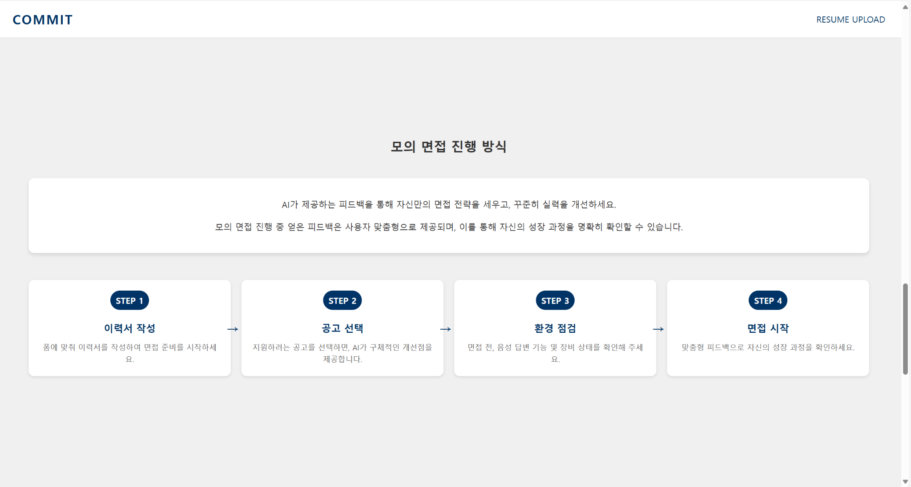

### 2) 지원 공고 선택
사람인 추천 공고를 기반으로 직무별 지원 자격을 확인하고 공고를 선택하면, 해당 공고에 맞춘 질문이 생성됩니다. 이력서 미작성 시 공고 선택이 제한되고, 공고를 선택하기 전에는 면접 시작 버튼이 비활성화됩니다.

  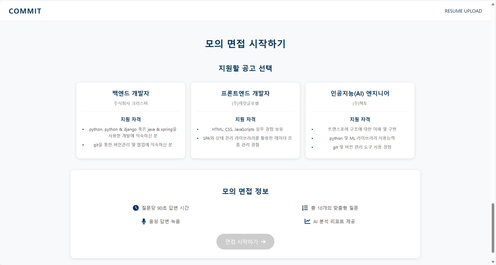

### 3) 이력서 작성
기본 정보와 프로젝트 경험·문제 해결 사례·팀워크 경험·자기 개발 노력 4가지 항목을 입력받아 맞춤형 질문 생성에 활용합니다. (항목별 500자 제한, 실시간 글자 수 표시)

  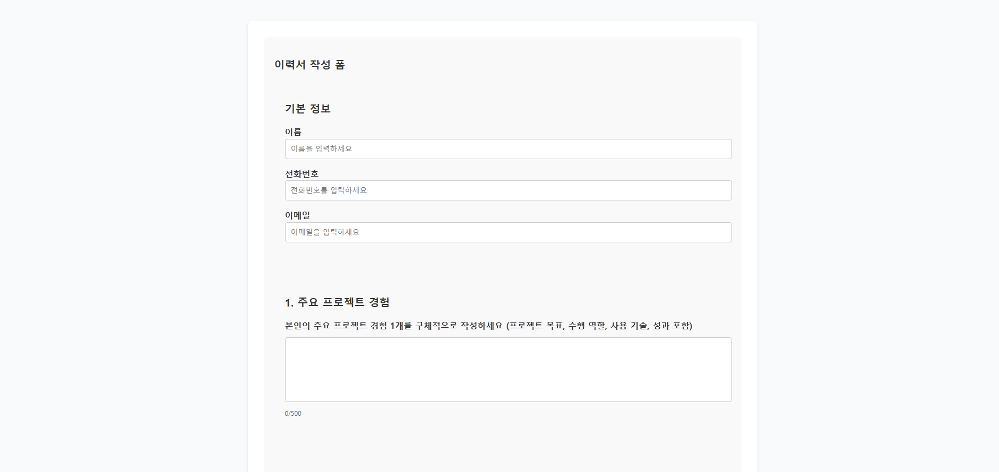

### 4) 모의면접 진행
AI 면접관이 질문을 제시하고, 90초 타이머 안에 음성으로 답변을 녹음합니다. 면접 종료 후 AI 리포트가 생성되는 동안에는 로딩 화면이 표시됩니다.

  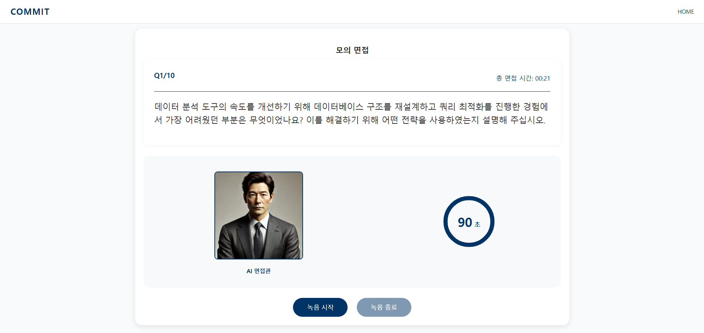

### 5) AI 리포트
질문 이해도·논리적 전개·구체성·문제 해결 접근·조직적합도의 평가 지표와, 말하기 속도·말더듬·발음 정확도 등 비언어적 요소를 종합 분석해 리포트로 제공합니다.

  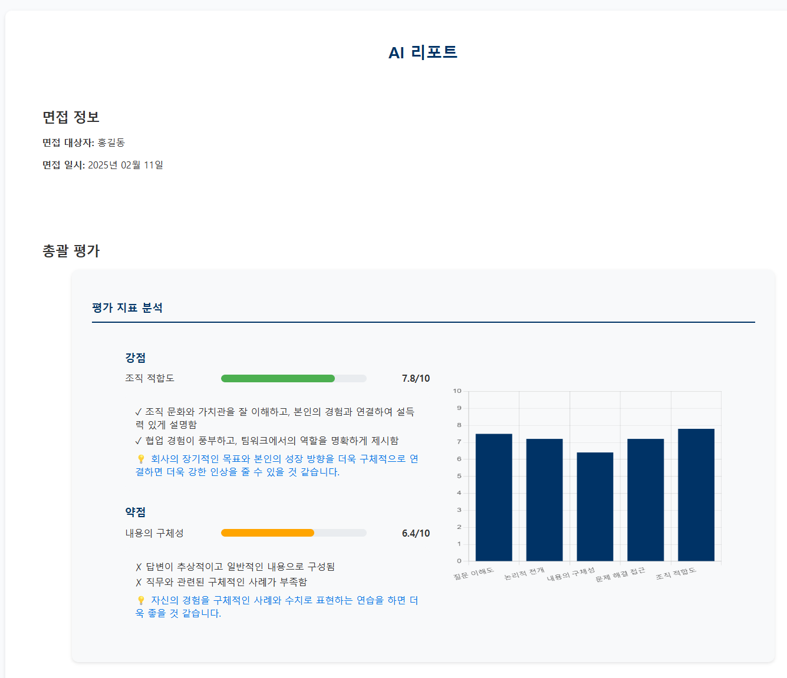

  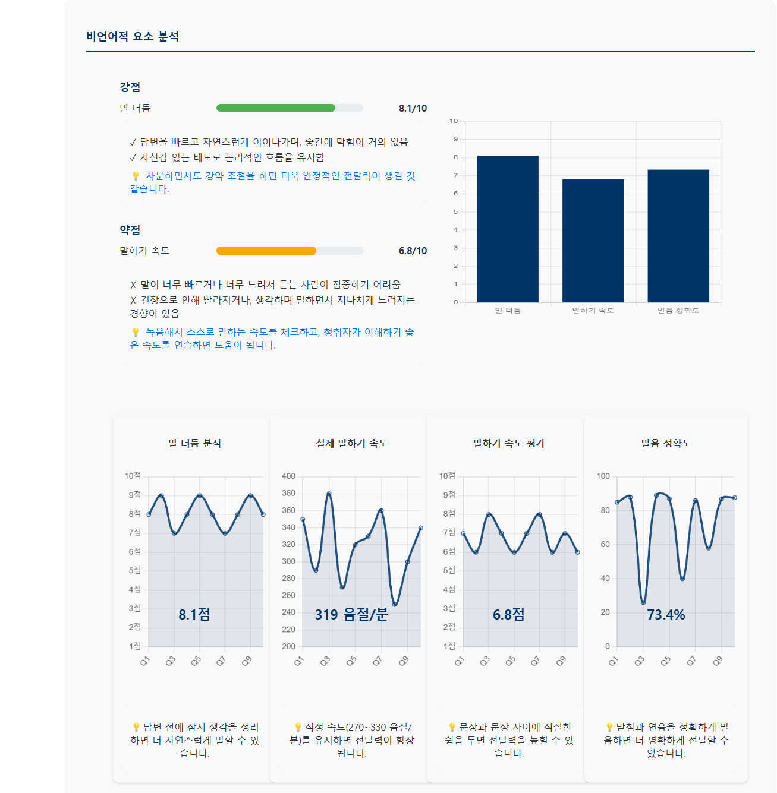

  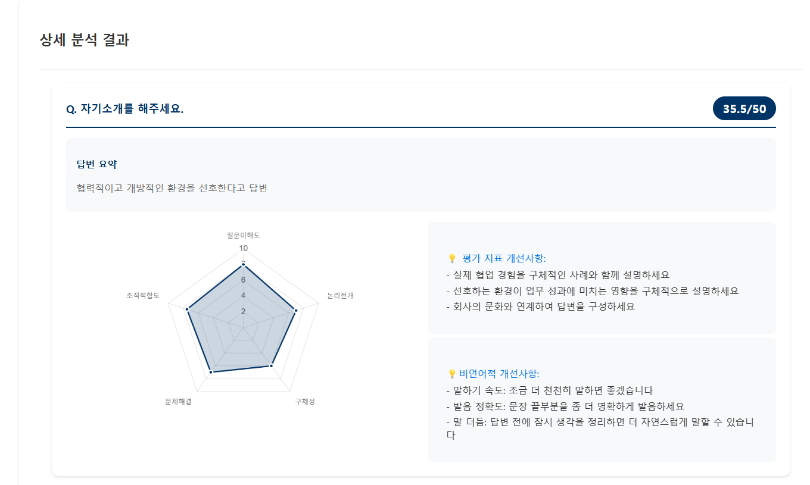

 

## 🏗️ System Architecture

  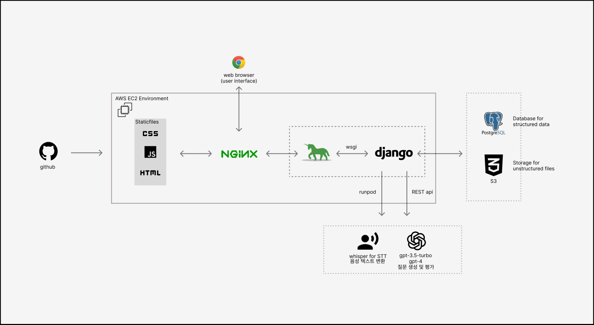

- **Frontend**: HTML / CSS / JS (Static Files)
- **Backend**: Django (WSGI, Gunicorn) + Nginx
- **Infra**: AWS EC2
- **Database**: PostgreSQL (정형 데이터), AWS S3 (음성 등 비정형 파일)
- **AI 연동**: RunPod 서버리스(Whisper STT), OpenAI REST API (GPT-3.5-turbo / GPT-4)

 

## 🔁 Activity Flow

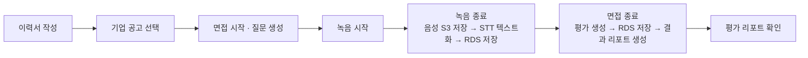

 

## 🤖 AI Model Pipeline

| # | 모델 | 사용 기술 | 역할 |
|---|---|---|---|
| 1 | 질문 생성 모델 | GPT-3.5-turbo | 이력서·채용공고를 분석해 5개 유형(프로젝트 경험/문제 해결/팀워크/자기 개발/직무 적합성)별 질문 10개 생성 |
| 2 | 음성 변환(STT) 모델 | Whisper (RunPod 서버리스) | 사용자의 음성 답변을 텍스트로 변환 |
| 3 | 답변 평가 모델 | GPT-4 | 5가지 기준으로 답변을 분석하고, 비언어적 요소까지 포함한 종합 평가 제공 |
| 4 | 답변 요약 모델 | GPT-4 (프롬프트 엔지니어링) | 면접 답변을 핵심 위주로 요약해 리포트 가독성·전달력 향상 |

### 모델별 평가 결과 요약

- **질문 생성 모델**: 이력서 관련성(SBERT 유사도) 0.82, 명확성(LanguageTool) 0.91, 직무 키워드 전문성(SBERT) 0.78
- **답변 평가 모델**: 동일 답변 3회 반복 평가 시 점수 변동 1점 이내로 일관성 확보 / 피드백 텍스트 엔트로피 3.5~3.9 수준으로 응답 다양성 확인 / 가독성(Flesh-Kincaid) 98.25
- **STT 모델**: 별도의 정량 평가 기준이 아직 없어, 모델 성능과 화자 발음 문제를 구분하기 어렵다는 한계를 발견 → 향후 개선 과제로 도출
- **답변 요약 모델**: 자체 프롬프트 설계 모델이 GPT 단순 요약 대비 정보 압축력 우수 (ROUGE 0.52 이상), 성과·수치 중심 요약으로 리포트 활용도 향상

 

## 👥 Team

| 이름 | 역할 | 담당 |
|---|---|---|
| 배윤관 | 팀장 | 백엔드 |
| 김지연 | 팀원 | 백엔드 |
| 박보람 | 팀원 | 프론트엔드 |
| 이상규 | 멘토 | 프로젝트 질의 응답, 피드백 |

공통: 기획, 데이터 수집, 데이터 전처리, 모델링

 

## 🛠️ Tech Stack

`Python` `Django` `Nginx` `Gunicorn` `AWS EC2` `AWS S3` `PostgreSQL`
`OpenAI GPT-3.5 / GPT-4` `Whisper` `RunPod`

 

## 📈 자체 평가

**잘한 점**
- 개인화된 면접 질문 생성
- 세분화된 답변 평가 및 피드백 제공
- 면접 결과 리포트 자동 생성

**보완 및 향후 개선사항**
- 로그인 기능 도입을 통한 사용자별 면접 기록 저장
- STT 모델 최적화 (배경 소음 처리, 잡음 제거)
- 꼬리 질문 유무를 통한 난이도 조절 기능 추가

**추가 기술적 발전 가능성**
- 사람인 API 연동으로 더 다양한 기업 공고 기반 면접 데이터 확장
- AI 답변 추천 시스템 도입 → 실시간으로 개선된 답변 예시 확인 가능

**결론**

본 프로젝트를 통해 AI 기반 인터뷰 평가 시스템의 가능성을 확인하였으며, 향후 로그인 기능, 모델 최적화, 난이도 조절 및 기업 공고 확장 등을 보완한다면 더욱 정교한 면접 피드백과 맞춤형 인터뷰 환경을 제공할 수 있을 것으로 기대합니다.

 

## 📅 프로젝트 수행 절차

개발 기간 8주 동안 아래 4단계로 진행했습니다. *(2024.12.20 ~ 2025.02.18)*

| 단계 | 내용 | 기간 |
|---|---|---|
| 1단계 · 분석 및 설계 | 프로젝트 기획, 기술 스택 조사, 데이터 수집 방법 검토 | 1주차 |
| 2단계 · 구현 | 데이터 수집·전처리, 아키텍처 구축, 기능/웹 개발 | 2~5주차 |
| 3단계 · 검수 및 테스트 | 내부 검수 및 통합 테스트, 코드 리팩토링 | 6~7주차 |
| 4단계 · 배포 및 모니터링 | 모델 배포, 성능 모니터링 | 8주차 |
